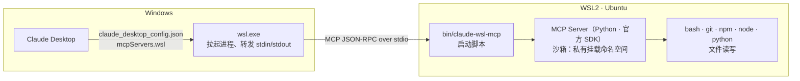

# claude-wsl-mcp

让 **Windows 上的 Claude Desktop** 通过 MCP 直接在 **WSL（Ubuntu）** 里干活：执行 shell 命令、读写文件、跑 git / npm / node / python，
并默认把 Windows 宿主机的文件隔离在外。

- 不需要在 WSL 里装 Claude Code，也不用重新登录——用的就是 Windows 上已登录的 Claude Desktop；
- 在对话里直接说“检查当前项目 git 状态”“安装依赖”“运行测试”“修改这个 Python 文件”“启动服务”；
- Chat 标签页和 Code 标签页（本地会话）都能用：Claude Desktop 会把 `claude_desktop_config.json` 里的服务器同时带给两者。

## 工作原理



调用链上每一环负责的事：

| 环节 | 负责什么 |
| --- | --- |
| `claude_desktop_config.json` | Claude Desktop 启动时读取，知道要拉起哪个本地 MCP 服务器、用什么命令 |
| `wsl.exe` | Windows 进程无法直接启动 Linux 程序，它是唯一的桥：**每次 Claude Desktop 启动时拉起服务器一次**，之后只转发 stdio，不参与每条命令 |
| `bin/claude-wsl-mcp` | 找到本仓库的虚拟环境并启动 Python 服务器；不向 stdout 输出任何内容，避免污染协议流 |
| MCP Server（`src/claude_wsl_mcp`） | 建立沙箱，向 Claude 提供 12 个工具；每次工具调用在 WSL 里真实执行命令或读写文件 |

服务器随 Claude Desktop 启动而启动、退出而退出，由 Claude Desktop 自动连接；后台任务（开发服务器等）独立于服务器进程，Claude Desktop 重启后仍在运行且可继续查看、停止。

## 工具

| 工具 | 作用 |
| --- | --- |
| `wsl_info` | 发行版、内核、用户、当前项目、沙箱状态、git/python/node/npm 版本与实际路径——确认“确实在 WSL 里执行”就调它 |
| `run_command` | 用 bash 执行命令，分别返回 stdout、stderr、退出码、耗时；带超时（杀整个进程组）与输出上限（超出部分落盘） |
| `start_background` / `background_status` / `stop_background` | 后台启动长期运行的程序（`npm run dev` 等），查看输出，停止 |
| `list_directory` / `read_file` / `search_files` | 列目录、按行读文件、按内容或文件名搜索（跳过 `.git`、`node_modules`、`.venv`） |
| `write_file` / `edit_file` / `delete_path` | 新建/覆盖文件、精确文本替换（返回 diff）、删除；只能写在工作区内 |
| `set_current_project` | 切换当前项目（命令默认目录），写回配置文件 |

## 安全边界

默认配置下，Claude 通过本服务器**碰不到 Windows 宿主机的文件，也调不起 Windows 程序**。
这不是靠检查命令字符串（`run_command` 能跑任意命令，字符串检查形同虚设），而是在操作系统层面做的：

1. 服务器以 root 启动后立即 `unshare` 出**私有挂载命名空间**，之后的挂载改动只影响服务器及其子进程，你自己开的 WSL 终端不受影响；
2. Windows 盘（`/mnt/c` 等 drvfs 挂载）默认**卸载并盖上只读空目录**（`hidden`），可改为只读（`readonly`）或不限制（`readwrite`）；
3. **禁用互操作**：`/run/WSL` 盖一层空 tmpfs、去掉 `WSL_INTEROP`，`cmd.exe`、`powershell.exe` 等拉不起来；`PATH` 里的 Windows 目录被剔除，`npm`、`python` 不会误用 Windows 版；
4. `/proc/sys`、`/sys` 改只读；子进程的能力边界集去掉 `sys_admin`、`sys_ptrace` 等——即使是 root 也无法重新挂载、`nsenter`、或经 `/proc/<pid>/root` 穿回宿主命名空间；
5. 文件类工具另有路径策略：拒绝 `C:\...` 形式的 Windows 路径，写入与删除只允许在 `workspace_root` 与 `extra_writable_roots` 之内，符号链接先解析再判断。

沙箱建立失败时服务器**拒绝启动**，不会降级运行。

**不在防护范围内**：服务器里的命令以 WSL 的 root 身份运行，可以修改 WSL 自身的任何文件；root 也可以请特权守护进程代劳（`docker run -v /mnt/c:...`、`systemd-run`、cron），这些进程在沙箱之外。
需要时把相应套接字加入 `sandbox.hide_paths`，例如 `["/run/docker.sock"]`。

## 安装

前提：Windows 10/11 + WSL2 发行版（在 Ubuntu 24.04 上验证）、Python 3.10+（含 `python3-venv`）、Claude Desktop 已安装并至少打开过一次。

```bash
# 在 WSL 里（root）
git clone <本仓库地址> ~/project/claude-wsl-mcp
cd ~/project/claude-wsl-mcp
./install.sh --project ~/project/你的项目
```

`install.sh` 会：创建 `.venv` 并安装依赖 → 生成 `~/.config/claude-wsl-mcp/config.toml`（已存在则沿用）→ 在独立命名空间里自检沙箱 →
把服务器写进 Windows 版 Claude Desktop 的配置（自动识别 MSIX 版与传统安装版的配置位置，只改 `mcpServers.wsl` 一项，改前备份）。

然后**完全退出** Claude Desktop（任务栏右下角托盘里右键 Claude 图标 → 退出），重新打开即可。只关窗口不算退出。

登记进 Claude Desktop 的内容形如：

```json
{
  "mcpServers": {
    "wsl": {
      "command": "C:\\Windows\\System32\\wsl.exe",
      "args": ["-d", "Ubuntu-24.04", "-u", "root", "--cd", "~", "--exec", "/root/project/claude-wsl-mcp/bin/claude-wsl-mcp"]
    }
  }
}
```

Node.js 不是本服务器的依赖；但若希望 Claude 在 WSL 里跑 npm/node，需要在 WSL 里装 **Linux 版** Node（否则 `npm` 可能解析到 Windows 版，而沙箱会把它屏蔽掉）。

## 配置

`~/.config/claude-wsl-mcp/config.toml`（可用环境变量 `CLAUDE_WSL_MCP_CONFIG` 或 `--config` 指定别处）：

| 字段 | 默认 | 说明 | 生效 |
| --- | --- | --- | --- |
| `workspace_root` | `~/project` | 工作区，文件工具可写的根 | 下次调用 |
| `current_project` | 同工作区 | **当前项目**：命令默认目录、相对路径基准 | 下次调用 |
| `extra_writable_roots` | `["/tmp"]` | 额外可写目录 | 下次调用 |
| `login_shell` | `true` | 用 `bash -lc` 执行，加载 `/etc/profile`、`~/.profile` | 下次调用 |
| `sandbox.windows_drives` | `"hidden"` | `hidden` / `readonly` / `readwrite` | 重启 Claude Desktop |
| `sandbox.windows_interop` | `false` | 是否允许调用 Windows 程序 | 重启 Claude Desktop |
| `sandbox.hide_paths` | `[]` | 额外隐藏的路径 | 重启 Claude Desktop |
| `limits.*` | 120 / 3600 / 30000 | 默认超时秒数、超时上限、单个输出流返回上限（字节） | 下次调用 |

**换项目**：改 `current_project` 这一行即可，无需重启；或直接对 Claude 说“切换到 xxx 项目”。

## 验证

- 在 Claude Desktop 里说：“调用 wsl_info”——输出里有 `microsoft-standard-WSL2` 内核、发行版名、沙箱状态；
- Windows 侧端到端测试（按 Claude Desktop 的方式拉起服务器并逐个调用工具）：

  ```powershell
  powershell -ExecutionPolicy Bypass -File \\wsl.localhost\Ubuntu-24.04\root\project\claude-wsl-mcp\windows\smoke-test.ps1
  ```

- WSL 侧自检：`bin/claude-wsl-mcp --check`

## 排障

- **Claude Desktop 里没出现工具**：确认是完全退出后重开的；看日志 `mcp-server-wsl.log`（服务器写到 stderr 的内容也在里面）。
  MSIX 版在 `%LOCALAPPDATA%\Packages\Claude_<ID>\LocalCache\Local\Claude\logs\`（实测）；传统安装版对应 `%LOCALAPPDATA%\Claude\logs\`，较旧版本在 `%APPDATA%\Claude\logs\`。
  正常连上时日志里有 `Server started and connected successfully` 和 `tools/list` 的应答；Desktop 启动时先拉起一次又立即关闭，属正常现象。
- **日志里“沙箱建立失败，拒绝启动”**：服务器必须以 root 启动（配置里的 `-u root`）。
- **命令报 `Read-only file system` / 找不到 `/mnt/c`**：这是沙箱在起作用；确需访问 Windows 盘就改 `sandbox.windows_drives`，然后重启 Claude Desktop。
- **命令超时**：`run_command` 默认 120 秒；长期运行的程序用 `start_background`。

## 卸载

```bash
.venv/bin/python -m claude_wsl_mcp.desktop_config --remove   # 从 Claude Desktop 配置里移除
rm -rf ~/.config/claude-wsl-mcp ~/.local/state/claude-wsl-mcp  # 配置与状态（后台任务日志等）
```

## 与 Code 标签页自带的 WSL 会话的区别

Claude Desktop 的 Code 标签页也能直接开 WSL 会话（它会在发行版里部署 Claude Code），但仅限 Code 标签页，且该模式下不支持连接器与插件。
本项目走标准 MCP，Chat 与 Code 标签页（本地会话）都能用，并额外提供 Windows 宿主机文件隔离。

## 开发

```bash
.venv/bin/python -m pytest -q     # 端到端用例需要在 WSL 里以 root 运行
```
